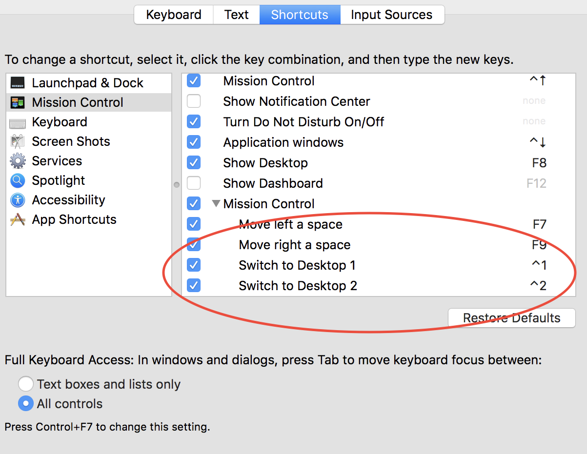
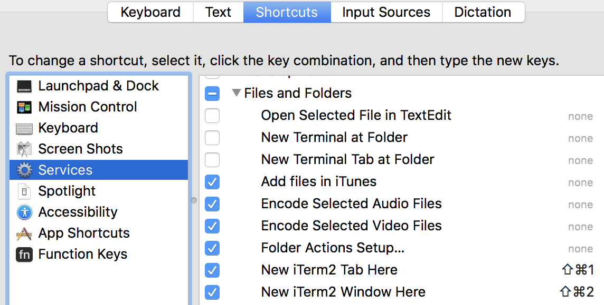

# Mattdibi's dotfiles
These are my configuration files. I need to add it to version tracking because I'm probably going to modify them a lot.

# Linux

## Applications
- Neovim:  [https://neovim.io/](https://neovim.io/)
- i3-wm: [https://i3wm.org/](https://i3wm.org/)
- regolith-desktop: [https://regolith-linux.org/](config/regolith/i3/config) ([Installation tutorial.](https://www.omgubuntu.co.uk/2019/06/install-regolith-linux-i3-gaps-ubuntu))

**Note: Regolith-desktop installation**
```sh
sudo add-apt-repository ppa:kgilmer/regolith-stable
sudo apt install regolith-desktop
```

## Installation
Install neovim (tested working with NVIM v0.9.5):

```sh
curl -LO https://github.com/neovim/neovim/releases/download/nightly/nvim.appimage
chmod u+x nvim.appimage
mv nvim.appimage /usr/bin/nvim
```

Enable Python support in Neovim
```sh
pip3 install --user --upgrade neovim
```

Simply type these commands on a terminal window:

```sh
git clone https://github.com/mattdibi/dotfiles.git
cd dotfiles/
ln -s $(pwd)/nvim $HOME/.config/nvim
```

### Plugin management

#### Packer-Nvim manual installation
```sh
git clone --depth 1 https://github.com/wbthomason/packer.nvim\
 ~/.local/share/nvim/site/pack/packer/start/packer.nvim
```

### Troubleshooting

#### Flickering apps

- Issue: [Graphical issues after update](https://github.com/regolith-linux/regolith-desktop/issues/116)
- Other informations: [Regolith Compositors](https://regolith-linux.org/docs/customize/compositors/)
- Solution: **Disable compton**

# macOS

## Applications
- Neovim:  [https://neovim.io/](https://neovim.io/)
- yabai: [https://github.com/koekeishiya/yabai](https://github.com/koekeishiya/yabai)
- skhd: [https://github.com/koekeishiya/skhd](https://github.com/koekeishiya/skhd)

### Neovim installation

```sh
brew install neovim
```

Configuration installation:

```sh
cd /path/to/dotfiles
ln -s $(pwd)/nvim "$HOME/.config/nvim"
```

Vim-Plug manual installation

```sh
sh -c 'curl -fLo "${XDG_DATA_HOME:-$HOME/.local/share}"/nvim/site/autoload/plug.vim --create-dirs \
       https://raw.githubusercontent.com/junegunn/vim-plug/master/plug.vim'
```

### Yabai installation

Follow [official instructions](https://github.com/koekeishiya/yabai/wiki/Installing-yabai-(latest-release)).

```sh
brew install koekeishiya/formulae/yabai
# start yabai
brew services start yabai
```

Open System Preferences.app and navigate to Security & Privacy, then Privacy, then Accessibility. Click the lock icon at the bottom and enter your password to allow changes to the list. Starting with brew services start yabai will prompt the user to allow yabai accessibility permissions. Check the box next to yabai to allow accessibility permissions.

:information_source: No need to disable *System Integrity Protection* for my needed features to be present.

### skhd installation

Follow [official instructions](https://github.com/koekeishiya/skhd).

```sh
brew install koekeishiya/formulae/skhd
# start skhd
brew services start skhd
```

Open System Preferences.app and navigate to Security & Privacy, then Privacy, then Accessibility. Click the lock icon at the bottom and enter your password to allow changes to the list. Starting with brew services start skhd will prompt the user to allow skhd accessibility permissions. Check the box next to skhd to allow accessibility permissions.

### Shortcut configuration

From the `dotfiles` folder

```sh
ln -s $(pwd)/yabai/yabairc ${HOME}/.yabairc
ln -s $(pwd)/yabai/skhdrc ${HOME}/.skhdrc
```

Workspace switch is handled [by Mission Control shortcut](https://apple.stackexchange.com/questions/213549/keyboard-shortcuts-for-switching-spaces).

<p align="center">

</p>

<p align="center">

</p>
